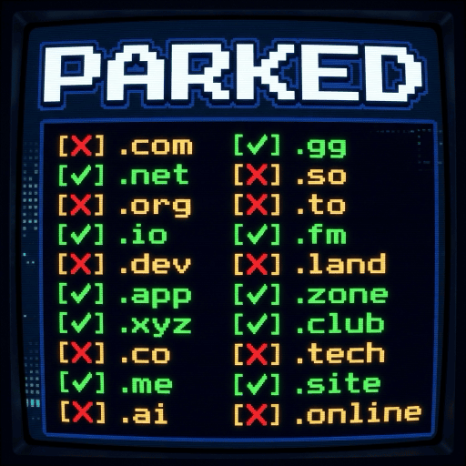

# parked

<p align="center">
  
</p>

Check if a domain name is registered. Uses tiered lookups: DNS first (fast), then WHOIS, then RDAP.

## Install

```bash
brew install bradleydwyer/tap/parked
```

Or from source (Rust 1.85+):

```bash
cargo install --git https://github.com/bradleydwyer/parked
```

## Usage

### Check a domain

```
$ parked example.com
example.com                    REGISTERED   (dns, 45ms)
```

### Check multiple domains

```bash
parked example.com xyznotregistered123.com google.com
```

### Verbose output

```bash
parked -v example.com
```

Shows tier-by-tier details: DNS record types, WHOIS registrar, RDAP status.

### JSON output

```bash
parked -j example.com
```

```json
[
  {
    "domain": "example.com",
    "available": "registered",
    "determined_by": "dns",
    "details": {
      "dns": {
        "has_records": true,
        "record_types": ["NS"]
      }
    },
    "elapsed_ms": 45
  }
]
```

## How it works

Each domain goes through up to three tiers:

1. **DNS** - Queries NS, A, and AAAA records. If any exist, the domain is registered. This catches most cases in under 50ms.
2. **WHOIS** - Connects to the TLD's WHOIS server (port 43). Parses the response for registrar info and "not found" patterns.
3. **RDAP** - Fetches the IANA bootstrap file to find the right server, then queries the API. A 404 means available.

If a tier confirms registration, later tiers are skipped. If all tiers are inconclusive, the result is `unknown`.

Built-in WHOIS server mappings for 30+ TLDs, plus IANA bootstrap for RDAP.

## License

MIT

## More Tools

**Naming & Availability**
- [available](https://github.com/bradleydwyer/available) — AI-powered project name finder (uses parked, staked & published)
- [staked](https://github.com/bradleydwyer/staked) — Package registry name checker (npm, PyPI, crates.io + 19 more)
- [published](https://github.com/bradleydwyer/published) — App store name checker (App Store & Google Play)

**AI Tooling**
- [sloppy](https://github.com/bradleydwyer/sloppy) — AI prose/slop detector
- [caucus](https://github.com/bradleydwyer/caucus) — Multi-LLM consensus engine
- [nanaban](https://github.com/bradleydwyer/nanaban) — Gemini image generation CLI
- [equip](https://github.com/bradleydwyer/equip) — Cross-agent skill manager
